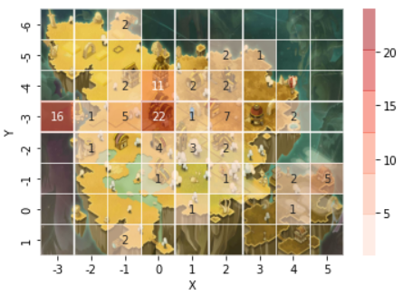
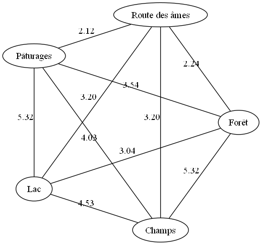
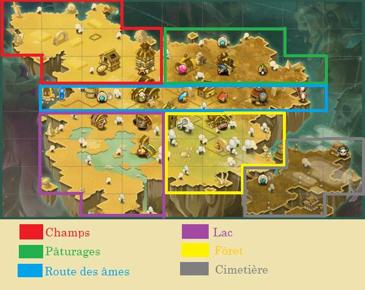
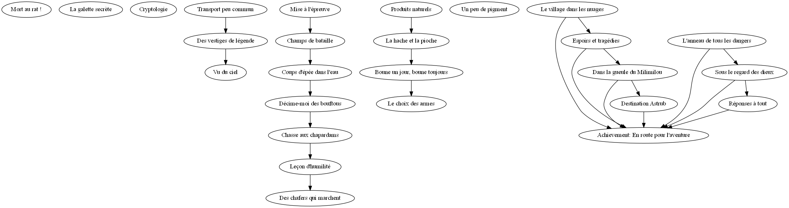
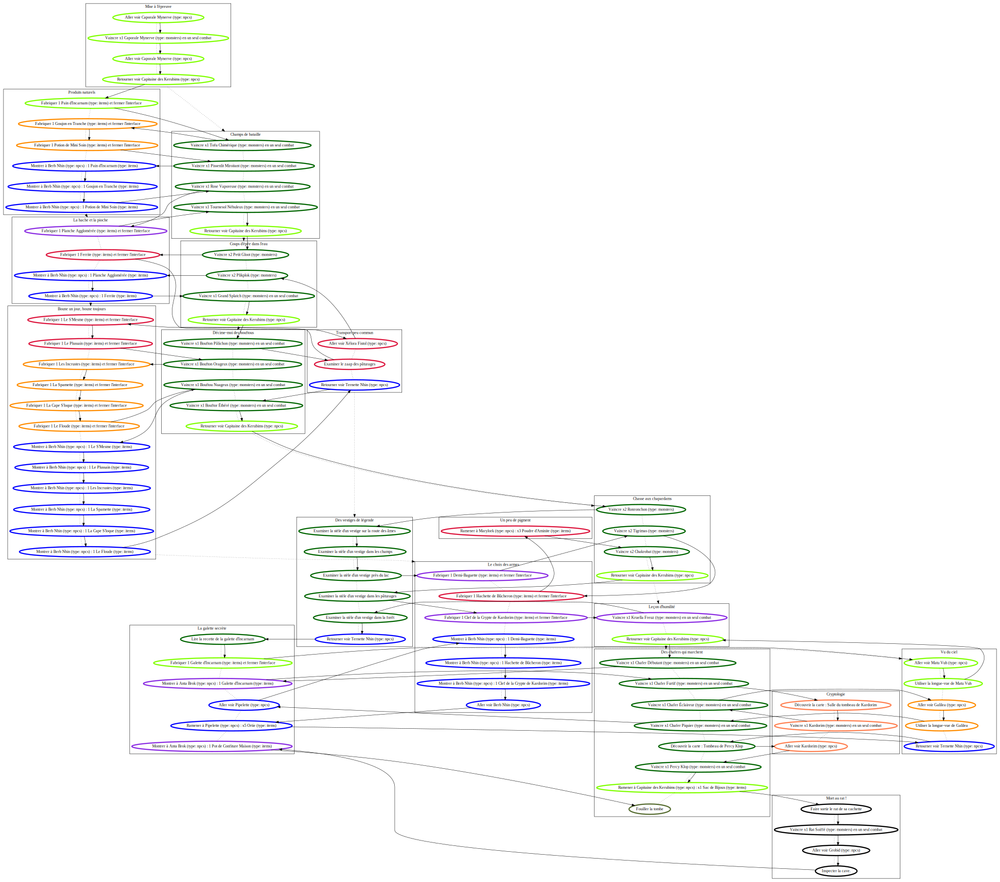

# Quest Chain Optimization for Dofus

A project aimed at optimizing the scheduling of quest chains in the game Dofus. Developed at the University of Technology of Compiègne, under the supervision of Sylvain Lagrue and Hénoïk Willot. For a complete description of the project, see the [report in French](./TX___Rapport.pdf).

## Requirements

You will need [GraphViz](https://graphviz.org/download/) to visualize graphs and [Clingo](https://github.com/potassco/clingo/releases/) to solve the quest scheduling. Ensure that both tools are included in your PATH.

## Installation

- Clone the repository
- Install the required packages by running:
    ```
    pip install -r requirements.txt
    ```

## Usage

You can find examples of how to use the `dofusdb` mini-library in the notebooks.

`gen_clingo.py` is a script that finds a quest scheduling that minimizes the Euclidean distance between quest substeps in order to complete a list of quests in an optimal way.

## `dofusdb.sqlite`

This database is a local and optimized version for our needs, based on the [DofusDB API](https://api.dofusdb.fr/). To use it, download an export of the data using the tool [DDB-Downloader](https://github.com/Plantim/DDB-Downloader). Place the JSON files in a `data` folder, then run the `create_db.ipynb` notebook to generate the database.

## Results

### Heatmap

To understand the distribution of quests, we created a simple heatmap of the quests in the first zone of the game:



### Distances

To define a minimization objective for the quest scheduling, we tested several distance functions, which can be seen in `compute_dist.ipynb`.



The zones correspond to:



### Precedence Graph

To visualize the connections and prerequisites of the quests, we generated precedence graphs. For more details on how to generate them, see `demo_api.ipynb`.



### Optimized Path

Finally, once the optimal path is found using Clingo, it is overlaid on the precedence graph of the quests (between quest sub-goals).



## License

This project is licensed under the [MIT License](LICENSE.md).
